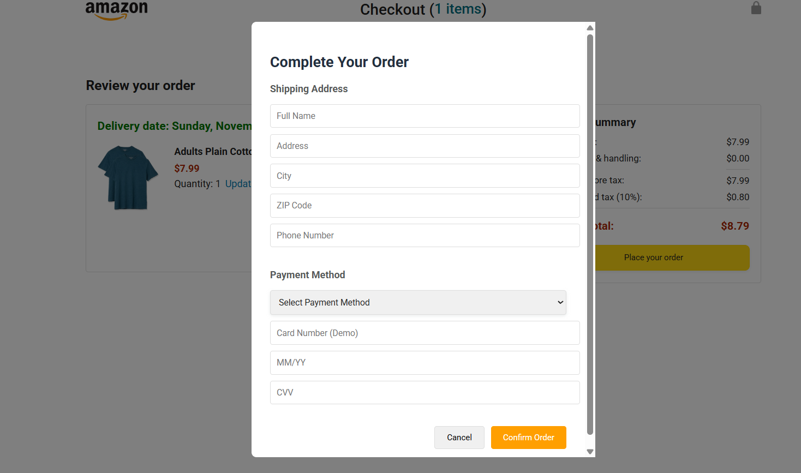

# Amazon Clone Project

🔗 **Live Demo:**  
[🌐 View Project](https://maazcodecraft.github.io/amazon-project/amazon.html)

---

## 📱 **Screenshots**

### Home Page


_Product browsing with real-time search and cart management_

---

### Checkout Page


_Order review with delivery options and pricing_

---

### Order Confirmation


_Complete order history with customer details_

---

### Track Order


_Real-time order tracking with progress visualization_

---

### Payment COnfirmation


_Real-time order tracking with progress visualization_

---

## Project Demo Video

[📥 Download Demo Video](project-screenshots/project-video.mp4)

## 🚀 Features

### 🛍️ **Shopping Experience**

- **Real-time Search**: Search products as you type with instant results
- **Product Grid**: Browse through 40+ products with ratings and prices
- **Add to Cart**: Select quantity and add items with visual feedback
- **Cart Management**: View cart quantity in header, updates in real-time

### 🛒 **Checkout Process**

- **Order Review**: See all cart items with delivery options
- **Delivery Options**: Choose FREE (7 days), Standard ($4.99, 3 days), or Express ($9.99, 1 day)
- **Dynamic Pricing**: Real-time price updates based on delivery selection
- **Customer Form**: Complete checkout with shipping address and payment details
- **Order Confirmation**: Instant order processing with cart clearing

### 📦 **Order Management**

- **Order History**: View all placed orders with customer details
- **Order Details**: See shipping address, payment method, and order totals
- **Buy Again**: One-click reorder of previous purchases
- **Smart Cleanup**: Clear only delivered products while keeping active orders

### 📍 **Order Tracking**

- **Real-time Status**: Dynamic tracking showing Preparing → Shipped → Delivered
- **Progress Bar**: Visual delivery progress based on order date
- **Delivery Estimates**: Accurate delivery date calculations
- **Customer Info**: Full shipping address and order details

---

## 🛠️ **Technical Features**

### **Frontend Technologies**

- **HTML5**: Semantic markup and responsive design
- **CSS3**: Modern styling with flexbox and grid layouts
- **Vanilla JavaScript**: ES6+ modules and modern JavaScript features
- **Local Storage**: Persistent cart and order data

### **Performance Optimizations**

- **Fast Loading**: Optimized scripts and minimal dependencies
- **Real-time Updates**: Instant UI updates without page refreshes
- **Event Delegation**: Efficient event handling for dynamic content
- **Modular Code**: Organized file structure with ES6 modules

### **User Experience**

- **Responsive Design**: Works on desktop, tablet, and mobile devices
- **Visual Feedback**: Loading states, success messages, and animations
- **Error Handling**: Graceful handling of edge cases and user errors
- **Accessibility**: Keyboard navigation and screen reader support

---

## 📁 **Project Structure**

```
amazon-project/
├── data/
│   ├── cart.js          # Cart management logic
│   ├── orders.js        # Order storage and retrieval
│   ├── products.js      # Product data and classes
│   └── deliveryOption.js # Delivery options and calculations
├── scripts/
│   ├── amazon.js        # Main page functionality
│   ├── checkout.js      # Checkout page logic
│   ├── orders.js        # Orders page rendering
│   ├── tracking.js      # Order tracking functionality
│   └── checkout/
│       ├── orderSummary.js    # Order review component
│       └── paymentSummary.js  # Payment calculation component
├── styles/
│   ├── shared/          # Common styles
│   └── pages/           # Page-specific styles
├── images/
│   ├── products/        # Product images
│   ├── icons/           # UI icons
│   └── ratings/         # Star rating images
├── amazon.html          # Main shopping page
├── checkout.html        # Checkout page
├── orders.html          # Order history page
└── tracking.html        # Order tracking page
```

---

## 🎯 **Key Functionalities**

### **Shopping Flow**

1. **Browse Products** → Real-time search and product discovery
2. **Add to Cart** → Select quantities and add items
3. **Checkout** → Review order and select delivery options
4. **Complete Order** → Fill customer details and confirm purchase
5. **Track Order** → Monitor delivery progress and status

### **Order Management**

- **View Orders**: Complete order history with customer details
- **Reorder Items**: Quick "Buy it again" functionality
- **Track Packages**: Real-time delivery status and progress
- **Clean History**: Remove delivered items while keeping active orders

---

## 🚀 **Getting Started**

1. **Clone the repository**

   ```bash
   git clone https://github.com/maazcodecraft/amazon-project.git
   ```

2. **Open the project**

   ```bash
   cd amazon-project
   ```

3. **Launch the application**

   - Open `amazon.html` in your web browser
   - Or use a local server for best experience

4. **Start shopping!**
   - Browse products and add to cart
   - Complete checkout process
   - Track your orders

---

## 💡 **Future Enhancements**

- **User Authentication**: Login/signup functionality
- **Payment Integration**: Real payment processing
- **Product Reviews**: Customer review system
- **Wishlist**: Save items for later
- **Advanced Filters**: Category and price filtering
- **Admin Panel**: Product management interface

---

## 🤝 **Contributing**

Contributions are welcome! Please feel free to submit a Pull Request.

---

## 📄 **License**

This project is open source and available under the [MIT License](LICENSE).

---

**Built with ❤️ by [Maaz ur Rehman](https://github.com/maazcodecraft)**
